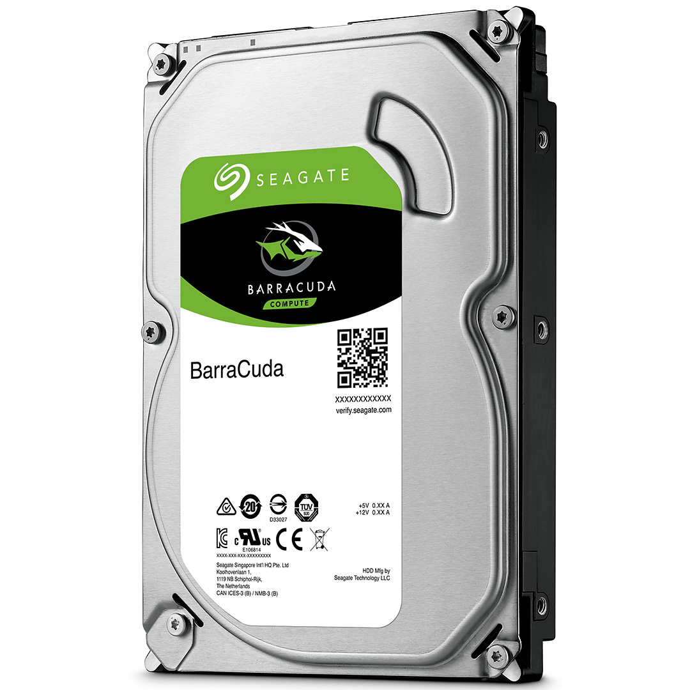

# My Build

**If you do not want to go through my parts and want to skip straight to the build guide,** [**click here**](../the-build/the-beginning.md)**.**

After careful consideration, I’ve created this system for gaming, streaming and video editing

\*\*\*\*

## CPU \(Processor\)

**For my processor, I chose an Intel Core i7 9700K. I chose it because for $589, you’re getting 8 cores clocked at 3.6GHz which can be overclocked to 4.9GHz, and it has lots of good reviews.**

\*\*\*\*

## Motherboard

**I chose an Asus PRIME Z390-P motherboard. It has a clean BIOS. Alongside, from my previous experience with this board, it gets the job done. Only problem I really have with it, is the fact that it only has one USB 2.0 header with 9 pins.**  

## Memory

**For my RAM, I chose 2, 8GB sticks of G.Skill Trident Z RGB RAM. That is in total, 16GB. I chose it because everything works out of the box and is compatible with Aura-Sync on Asus motherboards.**

\*\*\*\*

## Storage

**For storage, I chose a 512GB M.2 SSD from Intel. This will be used as my boot drive, so I can have one large mechanical drive dedicated to personal files and games, and one small solid state drive dedicated for my operating system, so my system is speedy and boots up in no time. I chose an M.2 SSD over a SATA SSD because M.2 NVME SSDs are generally a lot faster than SATA SSDs. I also chose it because I had an M.2 slot on my motherboard and I thought, “why not occupy it?”. My mechanical drive is a SeaGate Barracuda 2TB \(7200RPM\).**  

## Video Card

**For my video card, I chose a Nvidia GeForce RTX 2080. This card is amazing at 4K gaming, generally anything above that can be a struggle to find the right settings, but is great for most games. It has a great I/O of 1 HDMI port and 3 DisplayPorts and 8GB of VRAM, along with G-Sync compatibility. For the price of 1500 dollars, it’s a lovely card.**

## Case

**For our chassis or case, I chose the Corsair Crystal 460. It’s an ATX Mid-Tower case and is pretty good looking. It has a fully tempered glass design. It’s a lovely budget case and the built in lighting is awesome.**

\*\*\*\*

## Power Supply

**I chose a Corsair RMx750, which is a 750 watt power supply that is 80+ Gold Certified. Because it is a modular power supply, there are no cables pre-plugged in and instead, you get a big bag of cables which you can choose whether or not you want to use them. You can also get custom cables that have patterns and combs on them, pretty cool huh?**

<!--stackedit_data:
eyJoaXN0b3J5IjpbMjk0Nzc0ODJdfQ==
-->